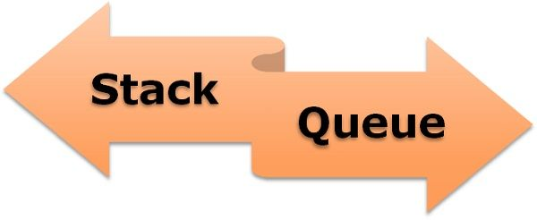

# Using Stacks and Queues

## Stacks
~~~~
Stacks are linear data structure in which insertion and deletion is allowed at only one end.
Implementation of stacks is based on LIFO or FILO.
    LIFO: Last In First Out
    FILO: First in Last Out
We can use arrays or linked lists to create stacks.
~~~~

## Queues
~~~~
These are linear data structure in which insertion and deletion is done at both ends.
Insertion is done at the rear end and deletion is done at front end.
Insertion is known as enqueue and deletion is known as dequeue.
Queues follows FIFO or LILO
  FIFO: First In First Out
  LILO: Last In Last Out
We can use arrays or linked lists to create stacks
